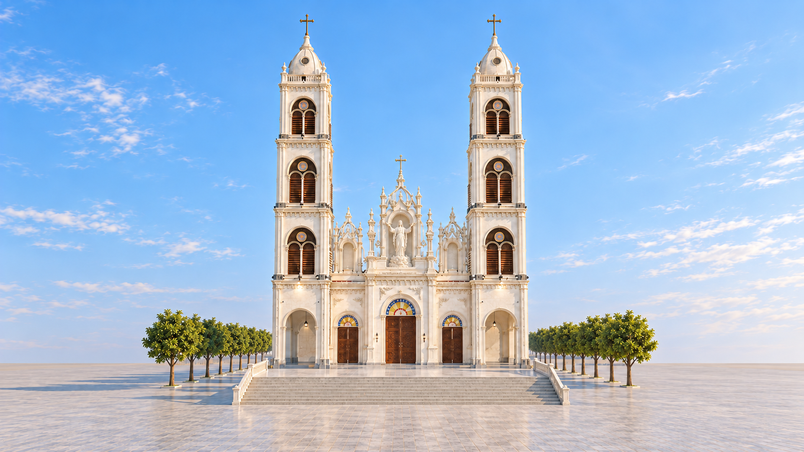
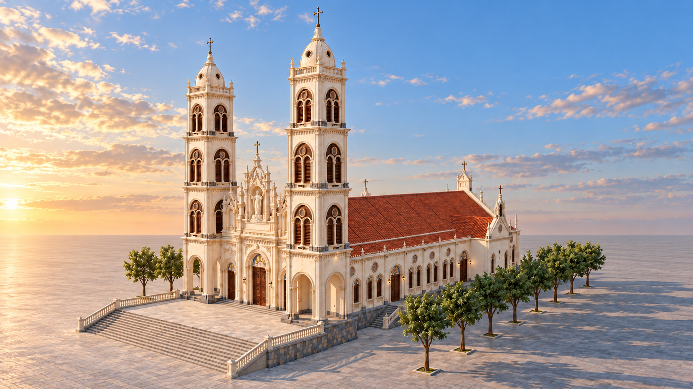
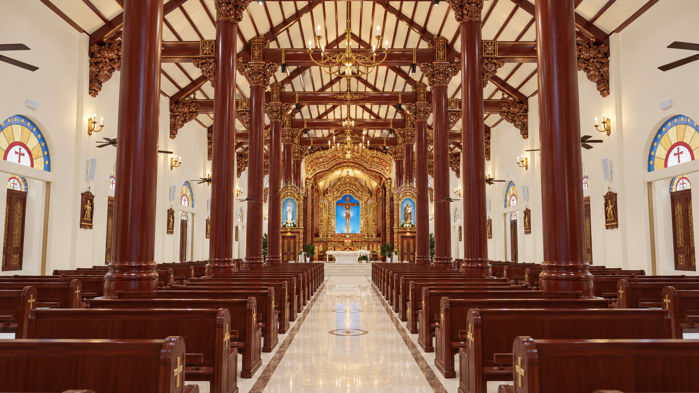
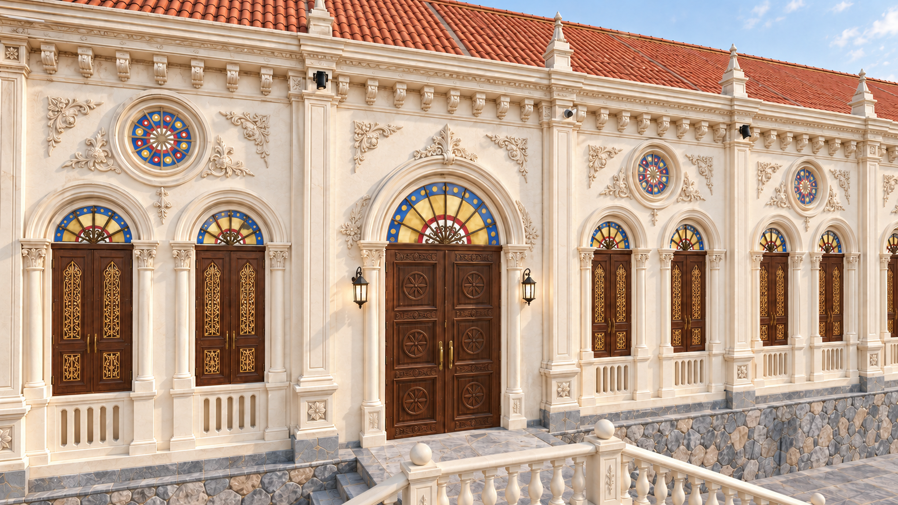
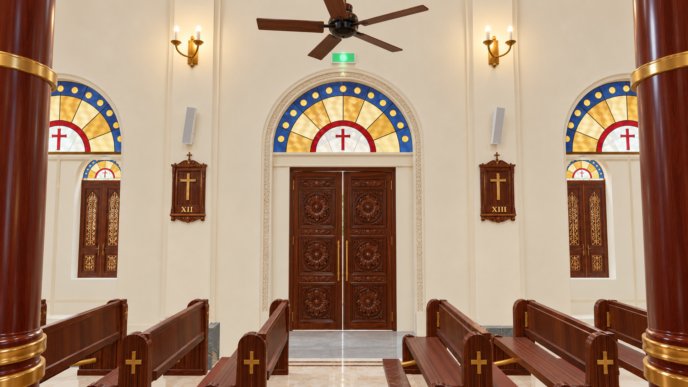
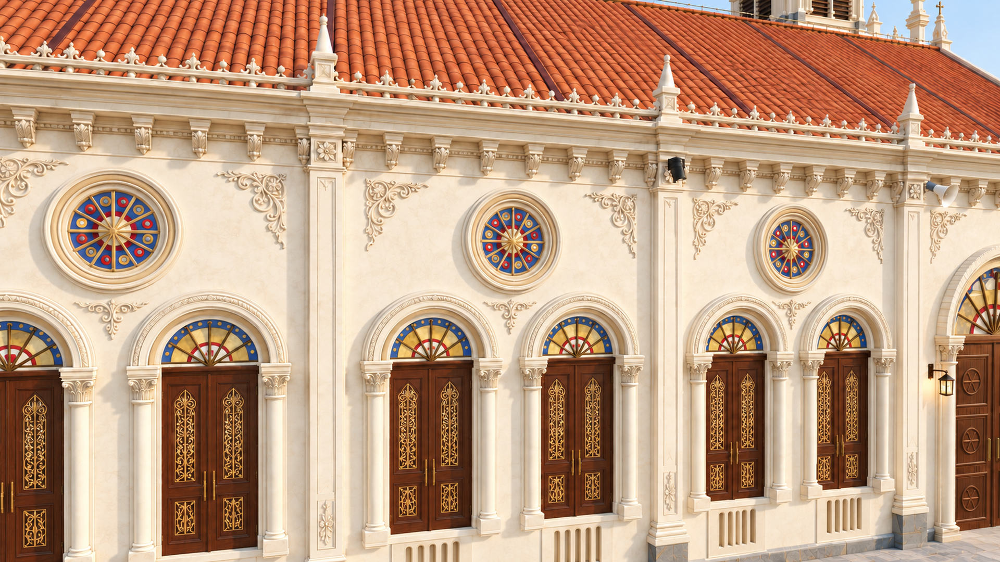
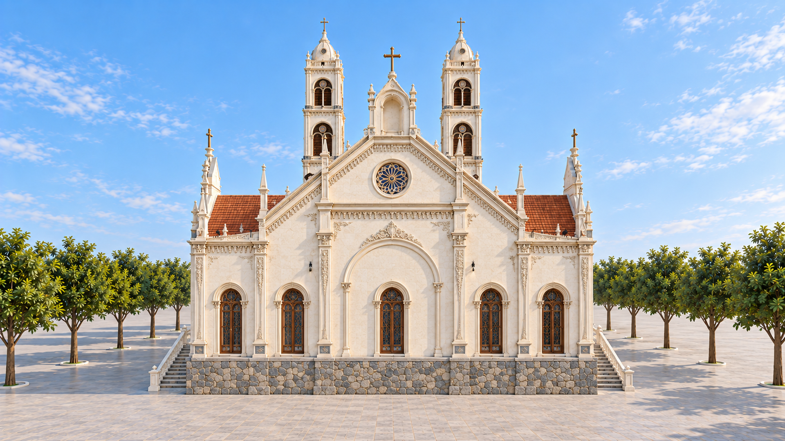
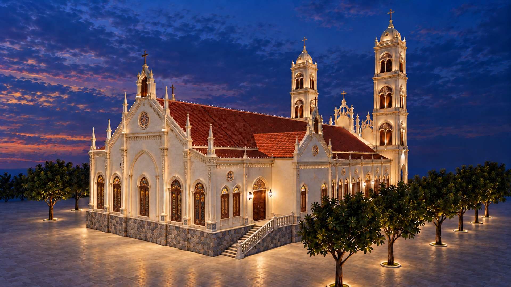
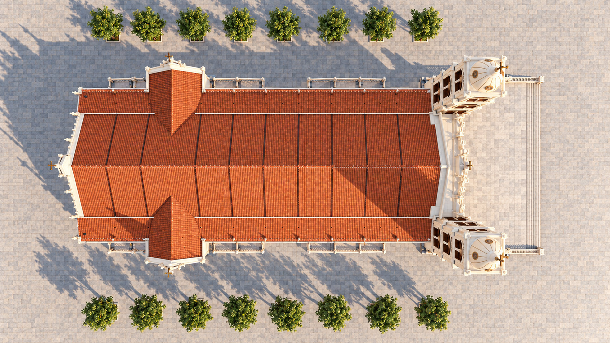
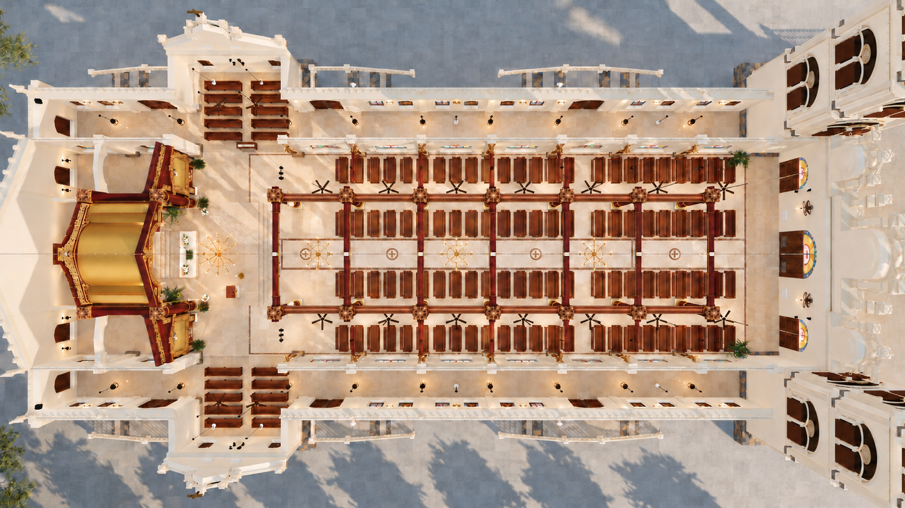

# Thạch Bi Church · October concept views

16 generated architectural views · 7 October 2026. Based on recorded model captures and approved art concepts.

[Open the gallery](index.html) · [Design notes](../../../../docs/church-view-renderings.md) · [Asset manifest](manifest.json) · [New prompts and review](../../../../review/church-views-2026-10-07/generation-additions-final.json)

Full HD files are 1920 × 1080 resampled copies; native originals are preserved. The latest side-window details use the owner-preferred carved timber and gold panels on both faces. Proposed longitudinal nave beams are illustrated in the overhead cutaway. These visual concepts do not establish dimensions, joinery or installed lighting performance.

## Church, sanctuary and carved connections

### Front elevation · daylight

Twin towers and the Assumption of the Blessed Virgin Mary in the central facade niche.

[Full HD PNG](../../03-facade/full-hd/2026-10-07-01-exterior-front-day.png) · [Native original](masters/01-exterior-front-day.png)

### Front and long side · daylight

Elevated oblique view showing the facade, Assumption statue, long side and terracotta roofs.

[Full HD PNG](../../03-facade/full-hd/2026-10-07-02-exterior-corner-day.png) · [Native original](masters/02-exterior-corner-day.png)

### Main entrance · close view

Closer oblique view of the three timber entrances, stone stage and Marian niche.

[Full HD PNG](../../04-doors/full-hd/2026-10-07-03-entrance-detail-day.png) · [Native original](masters/03-entrance-detail-day.png)

### Opposite front and side · evening

Opposite oblique view with warm facade accents and the Assumption statue at blue hour.

[Full HD PNG](../../03-facade/full-hd/2026-10-07-04-exterior-corner-evening.png) · [Native original](masters/04-exterior-corner-evening.png)

### Nave toward sanctuary · daylight

Long central aisle, timber columns and carved beam heads, with the approved sanctuary concept at the far end.

[Full HD PNG](../../00-overview/full-hd/2026-10-07-05-nave-overview-day.png) · [Native original](masters/05-nave-overview-day.png)

### Sanctuary overview · evening

Central Crucifix in its blue recess, Our Lady and Saint Joseph with Child, red lacquer and gilded carving.

[Full HD PNG](../../02-sanctuary/full-hd/2026-10-07-06-sanctuary-overview-evening.png) · [Native original](masters/06-sanctuary-overview-evening.png)

### Side aisle toward sanctuary · daylight

Eye-level side view combining the modeled aisle arrangement with the approved sanctuary and column-head art.

[Full HD PNG](../../00-overview/full-hd/2026-10-07-07-interior-oblique-day.png) · [Native original](masters/07-interior-oblique-day.png)

### Sanctuary carving and altar · close view

Oblique close view of the Crucifix niche, layered gilded relief, lacquered chamber and pale stone altar.

[Full HD PNG](../../02-sanctuary/full-hd/2026-10-07-08-sanctuary-detail-day.png) · [Native original](masters/08-sanctuary-detail-day.png)

### Carved column and beam connection · close view

Decorative study of carved haunches, column head, connected beams and upper rail. Concealed joinery is not specified.

[Full HD PNG](../../01-timber-frame/full-hd/2026-10-07-09-carved-connection-detail.png) · [Native original](masters/09-carved-connection-detail.png)

## Side entrances, wall decoration and rear elevation

### Side entrance · exterior close view

Carved timber side doors, stained-glass fanlight, ivory arch mouldings, wall relief and stone landing. Side shutters use the owner-preferred solid carved timber and gilded panels from the interior view.

[Full HD PNG](../../04-doors/full-hd/2026-10-07-10-side-door-exterior-day.png) · [Native original](masters/10-side-door-exterior-day.png)

### Side entrance · interior wall detail

Interior side-door arch, stained glass, devotional panels, wall sconces and nearby lacquered columns.

[Full HD PNG](../../04-doors/full-hd/2026-10-07-11-side-wall-interior-day.png) · [Native original](masters/11-side-wall-interior-day.png)

### Side wall · windows and decoration

Close view of the paired timber shutters, coloured fanlights, circular rose windows, pilasters and ornamental cornice. Side shutters use the owner-preferred solid carved timber and gilded panels from the interior view.

[Full HD PNG](../../05-windows/full-hd/2026-10-07-12-wall-window-decoration-day.png) · [Native original](masters/12-wall-window-decoration-day.png)

### Rear elevation · daylight

Straight view of the sanctuary-end exterior, five rear windows, central gable and continuous stone base.

[Full HD PNG](../../03-facade/full-hd/2026-10-07-13-rear-elevation-day.png) · [Native original](masters/13-rear-elevation-day.png)

### Rear and long side · evening

Oblique rear view showing the sanctuary-end wall, projecting wing, side entrances and distant front towers. Side shutters use the owner-preferred solid carved timber and gilded panels from the interior view.

[Full HD PNG](../../03-facade/full-hd/2026-10-07-14-rear-corner-evening.png) · [Native original](masters/14-rear-corner-evening.png)

## Top-down roof and interior views

### Top-down · roof and site

Overhead roof view showing both front towers, projecting wings, roof intersections, side stairs and two tree rows.

[Full HD PNG](../../06-roof/full-hd/2026-10-07-15-top-down-roof-day.png) · [Native original](masters/15-top-down-roof-day.png)

### Top-down · interior cutaway

Roof-hidden overhead concept showing the nave, four pew blocks, two central column rows, sanctuary and side wings. Two B03 longitudinal nave-row beams are shown as proposed connections from the structural art reference.

[Full HD PNG](../../00-overview/full-hd/2026-10-07-16-top-down-interior-day.png) · [Native original](masters/16-top-down-interior-day.png)

