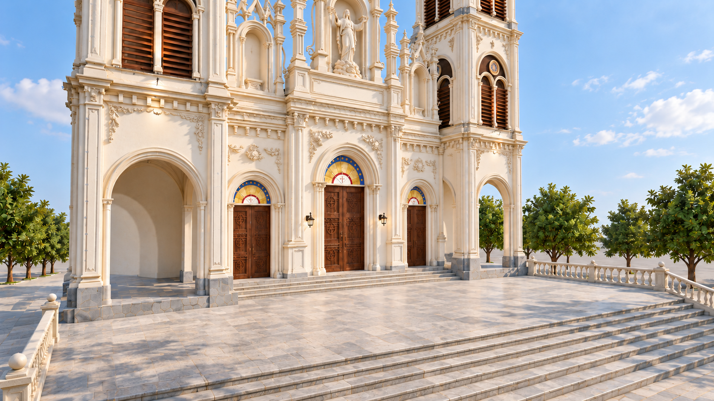
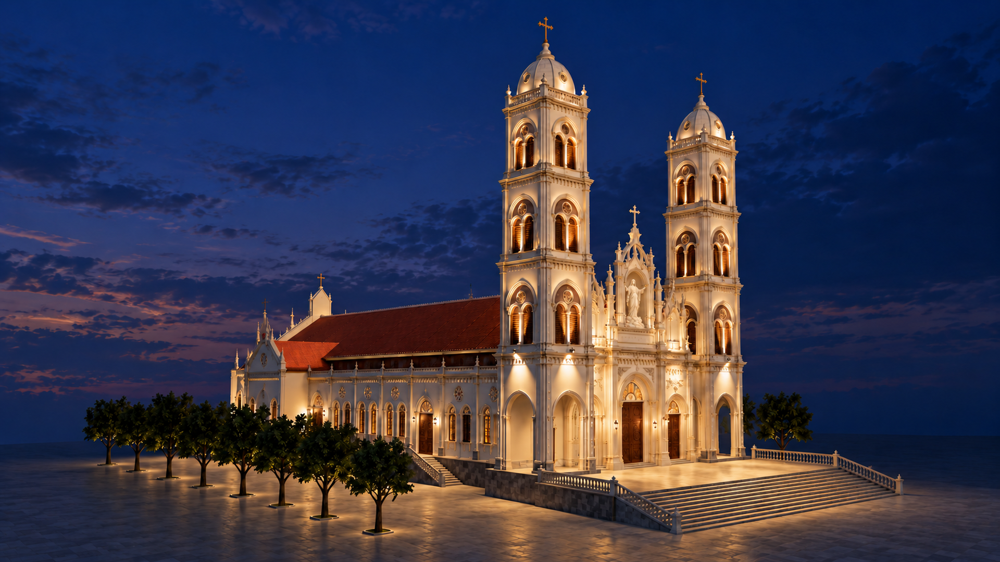

# Thạch Bi Church · October concept views

4 generated architectural views · 7 October 2026. Based on the current model and approved art concepts. These new images are proposed visualizations, not construction photographs or measured drawings.

[Open the gallery](index.html) · [Design notes](../../../../docs/church-view-renderings.md) · [Manifest](manifest.json) · [Prompts and source record](../../../../review/church-views-2026-10-07/generation-record.json)

Full HD exports are **1920 × 1080 resampled copies** of preserved **1672 × 941 native originals**. The owner authorized this export. Resampling adds no native detail. Only selected, visually reviewed images are included.

The model supplies layout and proportions; the approved sanctuary and timber concepts supply details that are unfinished in the model. The Assumption of the Blessed Virgin Mary appears between the front towers. These images do not authorize construction or establish engineering performance.

## Front elevation · daylight

Twin towers and the Assumption of the Blessed Virgin Mary in the central facade niche.

[Full HD PNG](full-hd/01-exterior-front-day.png) · [Native original](masters/01-exterior-front-day.png)

## Front and long side · daylight

Elevated oblique view showing the facade, Assumption statue, long side and terracotta roofs.

[Full HD PNG](full-hd/02-exterior-corner-day.png) · [Native original](masters/02-exterior-corner-day.png)

## Main entrance · close view

Closer oblique view of the three timber entrances, stone stage and Marian niche.

[Full HD PNG](full-hd/03-entrance-detail-day.png) · [Native original](masters/03-entrance-detail-day.png)

## Opposite front and side · evening

Opposite oblique view with warm facade accents and the Assumption statue at blue hour.

[Full HD PNG](full-hd/04-exterior-corner-evening.png) · [Native original](masters/04-exterior-corner-evening.png)

