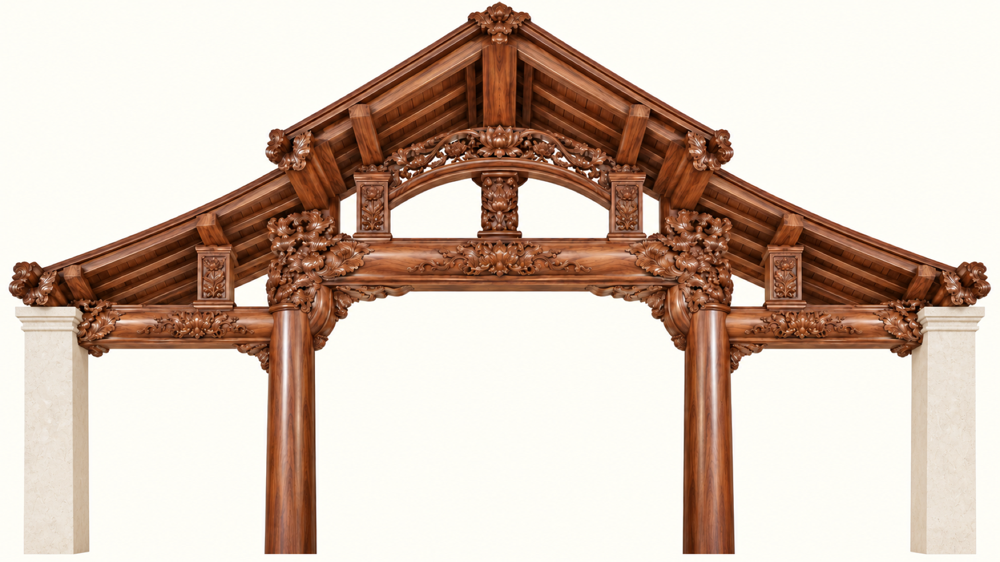
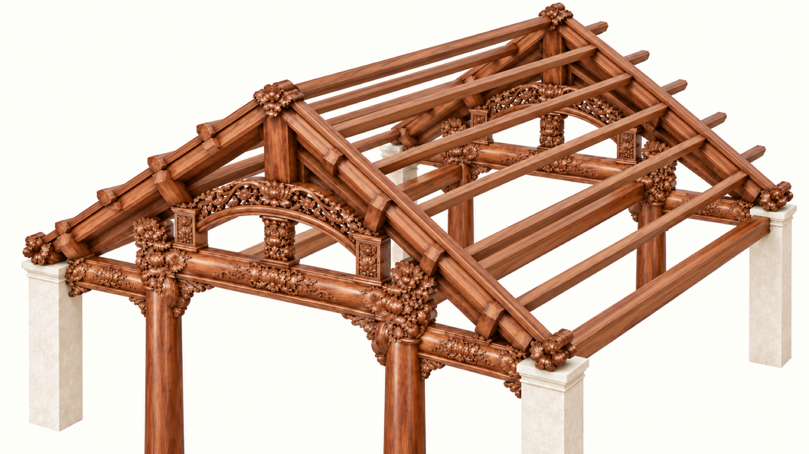

# Beams and roof connections reference package

Revision 2 · 7 October 2026 · Thạch Bi Church

This package records the agreed frame arrangement, the current drawing-based model geometry, proposed ornamental details, and the structural information needed to turn the concept into construction drawings. It supports both human design coordination and virtual-model implementation.

**Status: design development reference. Not issued for fabrication or construction.** No timber member, connection, anchor or bracing capacity has been verified. The owner has indicated that structural specifications are available, but those files have not yet been supplied in this chat or identified in this package.

Start with [SPECIFICATION.md](SPECIFICATION.md). Use [requirements.json](requirements.json) for machine-readable constraints and [image-manifest.json](image-manifest.json) for image provenance. Read the status of each value before using it.

The package is self-contained for its illustrations: eight separate Full HD concepts, five other-church photographs (one original photograph and four phone screenshots of a shared video, cropped on 10 October 2026 to remove the messaging-app frame and the sender's details), the architectural section image, plan image, and their corresponding source PDFs are included. The concept images are 1920 × 1080 exports resampled from 1672 × 941 generations; enlargement does not add native detail. No superseded all-timber outer-column concept is included.

## Primary illustrations

## Updating this package

Update the specification, requirements, connection records and image manifest together. Record the author, date, reason and source of a change in the revision table in the specification. Never promote a concept image, a mesh dimension or a software default to an approved structural requirement. Keep later approved engineering drawings separate and record their drawing number and revision before assigning them precedence for structural sizing.

Run `python3 docs/beams-roof-connections/validate.py` from the repository root after edits. It checks package files, images, dimensions and documented span arithmetic; it does not perform structural verification.

## Reference-library cleanup · 7 October 2026

The numbered viewer reference folders now display the newer church concepts. This engineering package continues to use its existing eight beam/roof illustrations and five source photographs; byte-identical duplicates were removed from the viewer folders on 7 October 2026, before the four screenshots were cropped. Their eight native generator originals are now preserved in `masters/`, recorded in the image manifest. Capacity and construction-approval status remain unchanged.
