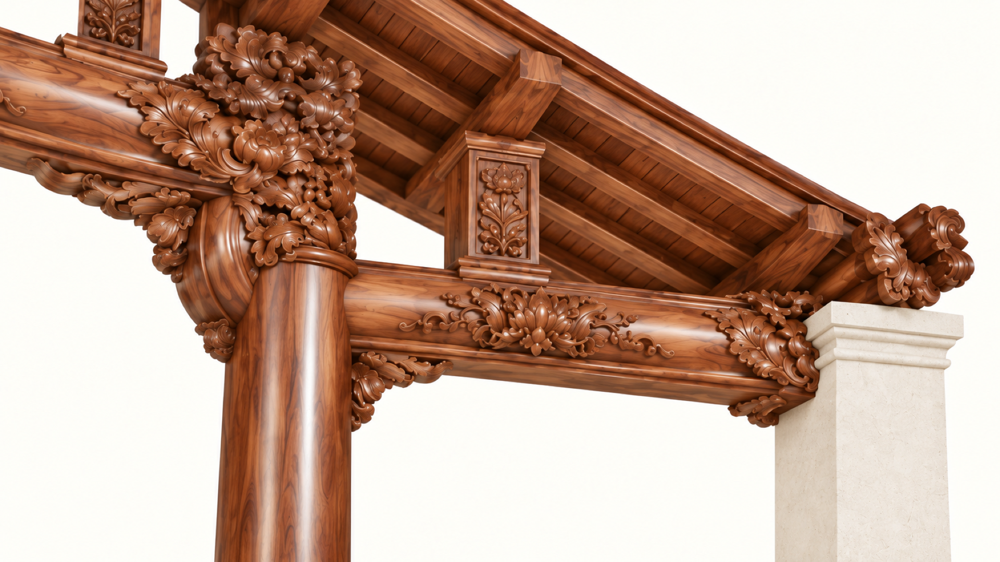
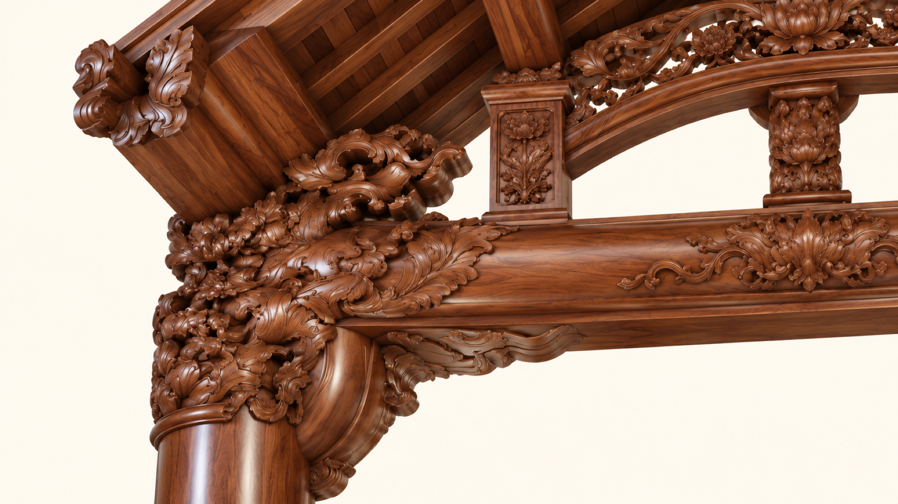

# Beam and roof connection specification

Revision 1 · 7 October 2026 · Design development reference

The church frame must read as a connected assembly across the nave, into both side aisles, and along the church length at column-head and roof levels. Only the two central columns in each typical transverse frame are timber. The two outer side supports are concrete. Carving develops the visible architecture; it must not be mistaken for evidence of structural capacity.

This specification is a coordination basis for the real building and its virtual model. It establishes layout and documentation requirements. **Member sizes, fixings, bearings, splices, bracing and erection procedures remain subject to project-specific structural design and approval.** It is not a shop drawing, fabrication schedule or certification of the existing structure.

## Evidence and precedence

| Status | Meaning and permitted use |
| --- | --- |
| USER CONFIRMED | Architectural intent explicitly corrected by the owner: two central timber columns, concrete outer columns, timber beams into side aisles, and lengthwise connections at upper roof level. This is not engineering approval. |
| DRAWING SHOWN | Geometry or arrangement visibly indicated by the supplied architectural drawing. It is not a strength calculation. |
| MODEL TRANSCRIPTION | Numeric value recorded in the existing model from its drawing interpretation. Recheck against the source PDF and a survey before fabrication. |
| DERIVED | Arithmetic using stated model or drawing inputs. It inherits their uncertainty. |
| CONCEPT | Generated ornament, profiles, finishes and illustrative member layouts. Do not scale dimensions from the pixels. |
| ENGINEERING HOLD | Information or approval needed before structural specification or construction. Use null, not zero, in machine data. |

Approved project structural drawings and calculations, when received and checked for revision, govern structural capacity and joint detailing. Architectural dimensions govern model placement until reconciled with those structural drawings. User corrections govern the intended appearance and material allocation. Generated images are subordinate to those sources. If sources conflict, record the conflict and obtain a design resolution; do not silently choose the most attractive image.

The primary section is supplied as [section image](sources/06-slide-cut-inside-church.png) and [section PDF](sources/giao-xu-thach-bi-06-mat-dung-mot-vi-than-nha-tho.pdf). The [plan image](sources/04-top-view.png) and [plan PDF](sources/giao-xu-thach-bi-04-mat-bang-tong-quan-nha-tho-giao-xu.pdf) provide plan context. The broader drawing set remains in `docs/layout_design`.

## Coordinate system and geometry register

Use metres in the model, with +Y upward, +X from the entrance toward the sanctuary, and Z across the building. When looking toward the sanctuary, the B/C/D side is negative Z and the E/G/H side positive Z. Floor ±0.000 is the nave finish datum; do not substitute column base or foundation levels.

| Item | Value | Status and qualification |
| --- | --- | --- |
| Central timber column lines D and E | Z = −3.600 and +3.600 m | MODEL TRANSCRIPTION; 7.200 m grid separation, not clear beam span |
| Outer concrete support lines C and G | Z = −7.360 and +7.360 m | MODEL TRANSCRIPTION; 3.760 m side-aisle grid width each side |
| Typical longitudinal grid interval | 4.500 m | MODEL TRANSCRIPTION; use actual bearing positions for structural span |
| Axes 9 to 10 | X = 36.975 to 44.175 m; interval 7.200 m | MODEL TRANSCRIPTION; wider projecting bay requires separate review |
| Main ridge datum | +12.472 m | DRAWING SHOWN; not necessarily the structural ridge-member centerline |
| Main eave datum | +7.130 m | DRAWING SHOWN; not a bearing elevation for every member |
| Idealized roof half-run | 7.360 m | MODEL TRANSCRIPTION |
| Main roof pitch from those datums | 35.973° | DERIVED: atan((12.472 − 7.130) / 7.360); finish thickness and actual structural offsets remain separate |
| Existing model main tie | 0.300 m longitudinal thickness × 0.590 m vertical depth; Y = 8.590–9.180 m | MODEL TRANSCRIPTION from the section interpretation; not an approved structural section |
| Existing model side beam | 0.220 m longitudinal thickness × 0.340 m vertical depth; Y = 6.660–7.000 m | MODEL TRANSCRIPTION; not an approved structural section |
| Existing model purlins | 0.090 m transverse width × 0.120 m vertical depth | Software geometry only; no verified section schedule |
| Existing modeled purlin row increment | 0.500 m horizontally across Z | Software placement, approximately 0.618 m along the idealized slope; do not describe it as verified 0.500 m slope spacing |

The typical model grid X positions are 3: 9.975, 4: 14.475, 5: 18.975, 6: 23.475, 7: 27.975, 8: 32.475, 9: 36.975, 10: 44.175, 11: 48.675 m. Sanctuary frames and roof valleys need their own geometry; do not duplicate a typical nave bay through them.

The generated full-width plate compresses the vertical hierarchy and stylizes the roof outline. The section drawing controls the actual roof profile and beam elevations. The pictures cannot establish the slope break, timber section, hidden connection or exact spacing.

## Member arrangement and role

| ID | Element | Arrangement and design requirement |
| --- | --- | --- |
| C01 | Central timber columns | Two round visible timber shafts per typical frame at D/E. Species, grade, diameter, base restraint and head net section are ENGINEERING HOLD. Older square-post software variants are not the authority for this reference set. |
| C02 | Outer concrete supports | Supports at C/G; pale square piers in the concept images. Confirm actual section, reinforcement, surface finish, cap and anchor zones. Do not replace them with carved timber shafts. |
| B01 | Main transverse tie | Crosses the nave between D/E. Preserve the intended restraint/load-transfer role until structural analysis resolves it; do not remove it merely to open the view. |
| B02 | Side transverse beams | Connect C–D and E–G, visibly continuous into the side aisles. Show timber-to-concrete support distinctly. |
| B03 | Longitudinal column-line beams | Run along X between successive frames at the required support levels. Represent the end bearing and connection at each frame; a continuous visual mesh does not prove physical continuity. |
| R01 | Principal roof members | Establish each transverse roof frame and support the roof-level longitudinal members. Their frame action, thrust restraint and support reactions need calculation. |
| R02 | Longitudinal purlins | Run parallel to X along both roof slopes and bear on successive principal frames. Spacing follows the approved roof build-up and calculation, not the image count. |
| R03 | Ridge-line member | Connects the roof-apex locations in the concept. Determine whether it is a structural ridge beam, purlin or alignment member; these are not interchangeable. A decorative ridge cap is not this member. |
| S01 | Stability system | Roof-plane diaphragm/bracing and longitudinal restraint must provide a designed route for horizontal forces to the supporting structure and foundations. Ordinary boards and purlins are not automatically a verified diaphragm. |
| O01 | Ornament | Carved collars, haunches, floral beam faces, short uprights and curved rails. Classify each as applied decoration or calculated structural timber. Do not assume the decorative arch supports the roof. |

Roof gravity loads must have a documented path through the actual covering/support layers, purlins and frames to columns/supports and foundations. Wind uplift reverses connection demands. Horizontal loads need a separately identified stability path. The final structural scheme must state how these actions reach the foundations, including any force transferred to the concrete structure. General connection and stability resources are indexed in the [WoodWorks technical guide](https://www.woodworks.org/mass-timber-technical-reference-guide/); it is background guidance, not the governing code or a design for this church.

## Connection detail schedule

These are requirements for the eventual connection drawings, not selected fastening solutions. All bolt sizes, counts, plate thicknesses, mortise depths, bearing lengths and anchor embedments are ENGINEERING HOLD. Do not infer concealed mortise-and-tenon joints, rigid joints or steel connectors from a photograph.

| Detail | Connection and intended representation | Required engineering resolution and drawing content |
| --- | --- | --- |
| J01 | Central column to transverse tie | Show column axis, beam underside, effective bearing and carved envelope separately. Resolve shear, bearing perpendicular to grain, splitting, withdrawal/uplift, any tie axial force and actual joint rotational stiffness. Check the residual column/beam section after mortises or carving. |
| J02 | Side beam to central timber column | Show the lower beam entering the column below the main tie, at drawing-controlled elevation. Check interaction between intersecting joints, edge/end distances and the remaining timber ligament; do not place separate decorative joints through the same unverified material volume. |
| J03 | Side beam to concrete support | Show the real bearing seat and timber/concrete boundary. Design bearing, uplift anchorage, lateral restraint, concrete breakout/edge conditions and reinforcement coordination. Resolve moisture separation, drainage, movement allowance and inspection access without inventing a standard seat size. |
| J04 | Longitudinal beam to frame/column | Show continuity along X and a supported end at each frame. Calculate gravity and any axial/lateral demands, torsion from eccentricity, joint slip and uplift. Define whether the joint is pinned, partially restrained or moment resisting in the analysis. |
| J05 | Purlin to principal roof member | Show both contact surfaces and roof pitch; resolve bearing, sliding down the slope, rotation/restraint and uplift. Any notch must have a checked net section. Keep ornamental rails out of the assumed load path. |
| J06 | Ridge member at frame apex | Identify the ridge member's structural function and its support reaction. Detail bearing/connection to the actual principal frame. Do not use the floral crown as a support or hide an unsupported ridge behind it. |
| J07 | Longitudinal member splice | Identify an engineered splice location and its force envelope. A splice above a support can still carry uplift or axial load; proximity to a support alone is not a capacity check. Define grain direction, fasteners, slip and inspectability. |
| J08 | Roof-plane/longitudinal bracing node | Identify actual braced bays or designed diaphragm, collectors and anchorage. Calculate force reversal and any tension-only action, stiffness and transfer into concrete/timber supports. Temporary erection bracing is a separate requirement. |
| J09 | Carved haunch or applied ornament | State whether the piece has a structural function. Applied ornament needs its own safe attachment and maintenance access; load-bearing carving needs calculation of its actual residual section. Never credit a decorative mesh as structural restraint. |
| J10 | Axes 9–10 and valley junctions | Resolve the wider bay, intersecting roof geometry, cut purlins, valley support and load concentration. Every interrupted member needs a designed support/load transfer; do not simply trim the mesh and leave a floating end. |

Each released connection sheet must include plan, elevation and section; member IDs and axes; timber grade/species and moisture basis; concrete grade/reinforcement interfaces where applicable; connector material/protection; force demand and capacity reference; fastener geometry; bearing/net sections; tolerances and movement; fire/durability requirements; and an inspection/erection sequence approved by the responsible designer.

## Calculation basis and unresolved inputs

Obtain the project location and governing design standards; structural framing and connection drawings; timber species/grade and strength/stiffness properties; section schedule; roof tile, battens, boarding and ceiling weights; maintenance and equipment loads; wind pressure/uplift and seismic basis where applicable; concrete/anchor specifications; durability, fire and deflection criteria. The photographs cannot supply these inputs.

Use consistent load-area definitions. A roof-surface area load and a horizontal-projection area load require different tributary-width conversions. Apply project load combinations and duration/service factors under the governing standard. Include equipment point loads only at approved attachment locations.

For a **simply supported prismatic beam under uniform line load w**, elementary span sensitivity is:

- Maximum bending moment: M = w L² / 8.
- End reaction: R = w L / 2.
- Elastic bending deflection: δ = 5 w L⁴ / (384 E I).

With the same w, E and I, a change from L = 4.500 m to 7.200 m gives a span ratio of 1.6, moment ratio **2.56**, reaction ratio **1.60**, and deflection ratio **6.5536**. These are conditional ratios, not a calculation of this roof's capacity. Actual bearing spans, continuity, point loads, axial action, joint slip, creep and load redistribution may change the result. Grid spacing is only a provisional span proxy.

Check bending, shear, compression/buckling, combined actions, lateral stability, bearing, deflection, creep, notches/net sections and connection behavior using the selected structural system. Check the complete stability system and foundation reactions. Do not choose a larger beam from the above ratios alone.

## Fabrication and site coordination requirements

Before fabrication, reconcile architectural and structural drawings, confirm surveyed geometry and release the member/connection schedules. Produce a representative carved joint mock-up after its structural envelope and attachment method are approved. Keep decoration outside required bearing and connector access zones unless included in the structural calculation.

Specify timber moisture acceptance, grading, treatment, coating compatibility, fire performance and corrosion protection for the actual exposure. Separate decorative chestnut color from wood species: a brown render does not specify chestnut timber. Allow for timber movement relative to concrete. Protect vulnerable ends and joints from trapped water; detail maintenance access.

Coordinate lights, fans, speakers and cable routes before drilling or cutting. Their attachment loads, vibration and cable holes require approved locations. Do not assume carved brackets or small roof members can carry equipment. The renderer's finish response and lux estimates do not establish structural or lighting-installation compliance.

The contractor and engineer must define lifting points, temporary support/bracing, erection order, connection inspection and acceptance criteria. This reference package supplies no erection method.

## Virtual model implementation requirements

1. Build from axis coordinates and datum elevations, not image pixels. Keep X/Y/Z units explicit. Store architectural envelope datums separately from structural member centerlines and bearing planes.
2. Use separate objects/layers for columns, primary beams, principal roof members, purlins, ridge member, connections, stability elements, applied ornament and equipment. Aesthetic mesh merging for rendering must retain the source object metadata.
3. Name members by family, axis and bay, for example `B03-D-04-05`; name connections by detail and node, for example `J04-D-04`. Record both endpoint supports for longitudinal members.
4. Record `source`, `sourceRevision`, `status`, `materialRole`, `structuralRole`, `sectionStatus`, `connectionIds` and `engineeringApproved` on each source object. Unknown engineering values remain null. Defaults remain marked as visualization proxies.
5. Provide distinct as-drawn and concept modes. Keep unverified bracing visible in a review layer when requested; do not describe a hidden or absent bracing mesh as proof of stability. The two central timber/concrete outer-support rule applies to the current concept.
6. Implement purlins by support-to-support segments or an explicit continuity record. At valleys, include support nodes or flag unresolved ends. Do not use one church-length mesh to imply a single physical timber.
7. Preserve real connection depth, nonintersecting member cores, actual bearing planes and side/longitudinal returns. Ornament can overlap visually but must not erase the structural core or bridge an unsupported gap.
8. Keep metal/wood/concrete material identity independent of display color and lighting. The natural-brown beam concept and sanctuary red/gold palette are distinct finish references pending material selection.
9. Export per-member and per-connection metadata with the model. Show unresolved engineering items in handoff reports. Do not export an illustrative mesh as a construction-approved fabrication part.

## Acceptance and handoff

For the virtual model, verify four support positions per typical frame; two timber inner columns and two concrete outer supports; both side beams; longitudinal continuity at support and roof levels; bearing contacts at both ends; no unexplained collisions or unsupported trimmed ends; correct source elevations; separate handling of the wider bay; and preservation of status/provenance through export. Compare front, side, roof-open oblique and underside views. These are geometry checks, not strength checks.

For the real building, release requires the responsible structural engineer's checked calculations and drawings, coordinated architectural/shop drawings, material and connector specifications, and the project inspection/approval process. The jurisdiction, approving parties and current code editions remain to be confirmed for this project.

## Image register

The following images are generated concepts, all supplied as separate 1920 × 1080 exports. Their native masters remain in the viewer reference library. Consistency of carving across generated views is approximate; the structural drawing and resolved detail schedule control a buildable assembly.

| File | Use and limitation |
| --- | --- |
| [07 full-width frame](images/07-full-width-frame-concrete-sides.png) | Primary material/layout concept: two central timber columns and concrete outer supports. Elevations/proportions remain illustrative. |
| [08 two frames](images/08-longitudinal-beams-two-frames.png) | Column-level longitudinal continuity. Roof members intentionally incomplete; use image 10 for upper topology. |
| [09 side bearing](images/09-side-beam-concrete-bearing.png) | Visual wood-to-concrete meeting and side-beam carving. Not an engineered seat/anchor detail. |
| [10 upper roof](images/10-upper-roof-longitudinal-connections.png) | Ridge/purlin connectivity. Row count, sections, fixings and bracing are not specified by this image. |
| [01 central bay](images/01-upper-bay-front.png) | Central component only; not the full church cross-section. |
| [02 column head](images/02-column-head-three-quarter.png) | Carved profile and moulding depth; concealed joint unresolved. |
| [03 bracket underside](images/03-carved-bracket-underside.png) | Ornamental underside; no assumed structural capacity. |
| [04 upper rail](images/04-upper-rail-roof-connection.png) | Visible ornamental layering; not proof that the rail or short upright supports the roof. |

The five original other-church photos in `sources/` establish visible timber craftsmanship only. They do not establish this church's dimensions, material strengths or hidden joints. Source copies and package images are listed with hashes in [image-manifest.json](image-manifest.json). Superseded concepts 05 and 06 incorrectly used timber outer columns and must not be used.

## Revision record

| Revision | Date | Author | Change and release status |
| --- | --- | --- | --- |
| 1 | 2026-10-07 | Codex, from owner instructions and repository evidence | Initial coordinated specification and image package. Design development only; engineering approval pending. |
